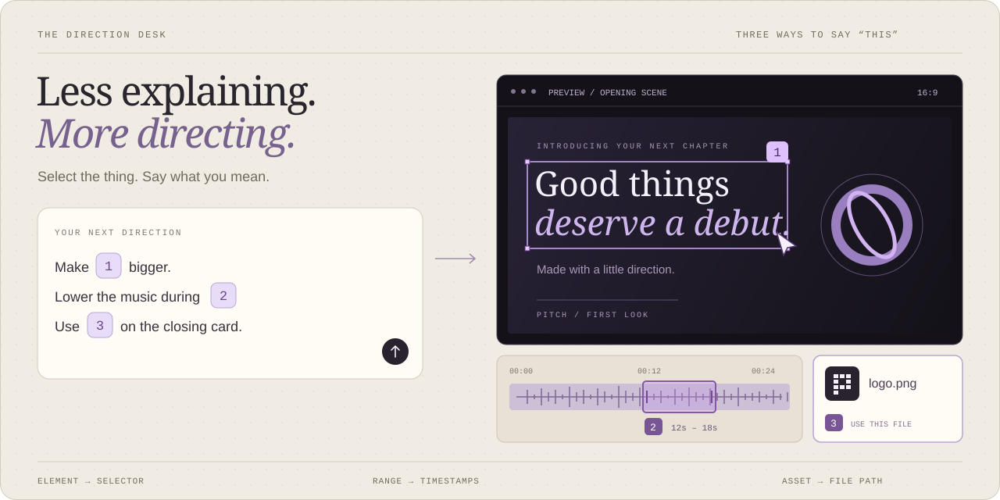
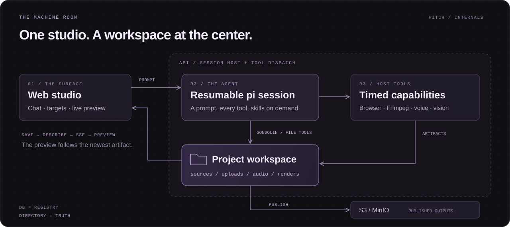

<div align="center">

<p>
  <a href="https://trypitch.co">
    
  </a>
</p>

<br />

**An AI production studio you can actually direct.**

Bring a URL, a recording, a deck, or an idea.<br />
Watch the agent work. Point at the preview. Ask for the next cut.

<br />

**[Open the studio ↗](https://trypitch.co)** &nbsp; / &nbsp; [The experience](#the-experience) &nbsp; / &nbsp; [Under the hood](#under-the-hood) &nbsp; / &nbsp; [Run locally](#run-locally) &nbsp; / &nbsp; [API & MCP](#api-and-mcp)

<br />

</div>

## 01 / The brief is the interface.

Pitch puts an agent beside a live preview. It can browse a real product, compose motion graphics, build slides, edit recordings, and render the result. The conversation stays attached to the work, so the next instruction can be as small as **“make this headline bigger”** or as ambitious as **“now turn this into a launch film.”**

Every project has the same foundation: **a workspace, a resumable agent session, and a live preview.** The agent chooses its tools from the request. You can change direction mid-conversation.

<table>
<tr>
<td width="50%" valign="top">

### ↗ The launch film
**“Give this product a proper entrance.”**

Product research, scripted motion graphics, narration, music, and a rendered film. Compositions play live through the `shots.js` engine.

</td>
<td width="50%" valign="top">

### ◎ The product demo
**“Show someone why this is useful.”**

An agent drives the real browser, records the walkthrough, and builds a narrated demo. You can watch the browser as it works.

</td>
</tr>
<tr>
<td width="50%" valign="top">

### ▤ The slide deck
**“Make the argument land.”**

Start with a topic or an existing PDF/PPTX. Build or rework the slides, inspect individual elements, and publish the deck.

</td>
<td width="50%" valign="top">

### ↺ The next cut
**“Keep the take. Fix the pacing.”**

Upload a recording, select a moment or a range, and ask for an edit. Transcription, camera moves, cards, and audio adjustments are tools in the same studio.

</td>
</tr>
</table>

Need original footage or another media operation? Generated video and general-purpose media tools are part of the same toolkit.

<br />

<a id="the-experience"></a>

## 02 / “This” is a precise instruction.

<p>
  
</p>

<sub>Illustrated interaction. Selections become numbered targets in your next message.</sub>

<br />

| Point at… | Say something like… | What the agent receives |
| :--- | :--- | :--- |
| **An element** in a film or slide | “Make **[1]** bigger.” | The element’s selector and scene or slide context. |
| **A moment or range** in a video | “Lower the music during **[2]**.” | A timestamp or start/end range in seconds. |
| **A file** on the asset shelf | “Use **[3]** for the closing card.” | The workspace-relative path to the source asset. |

The thread streams the agent’s messages, tool calls, and results. Saving an artifact refreshes the preview; the newest artifact becomes the thing you see. Drop a file into a new project and it opens for inspection before you even send a prompt.

**The asset shelf fills itself.** Uploads, generated images, audio, and finished renders are discovered from the workspace. A file the agent makes is a file you can point to next.

<br />

<a id="under-the-hood"></a>

## 03 / The directory is the truth.

<p>
  
</p>

A project’s source files, recordings, and renders live together. The database tracks ownership, session references, and published outputs. **Status and previews are derived from the work on disk.**

| Piece | What it does |
| :--- | :--- |
| [`apps/web`](apps/web) | The app shell and studio: conversation, previews, selection targets, asset shelf. |
| [`apps/api`](apps/api) | One server for projects, agent sessions, auth, usage, rendering, sharing, REST, and MCP. |
| [`.pi`](.pi) | The agent’s base prompt, tool extensions, skills, and host bridge. |
| [`engine`](engine) | The `shots.js` compiler and the inspector loaded by previews. |
| [`packages`](packages) | Database access, shared types, object storage, and email. |

<details>
<summary><strong>Engineering notes / where the boundaries are</strong></summary>

<br />

- **One toolkit per project.** Capabilities are host actions plus skills. The agent reads the relevant skill when it needs a pipeline.
- **A sandbox for file work.** Built-in tools run in a Gondolin VM with a writable `/workspace` and read-only engine, skills, and assets. Node and Python are available there; network access, browsers, and FFmpeg belong to host tools.
- **Heavy work stays close.** The API hosts the sessions and dispatches rendering, transcription, speech, and browser work through host tools. There is no separate worker or job queue.
- **Compute is measured.** Model spend and timed host actions accrue against the project. Opening a project costs nothing; credits are drawn down as usage crosses billing boundaries.
- **The preview follows the artifact.** HTML compositions, decks, video, and live browser sessions share the same studio surface.

**Built with:** Bun · TypeScript · pi · Gondolin · PostgreSQL · Prisma / ZenStack · FFmpeg · GSAP · CloakBrowser · Gemini · ElevenLabs · S3 / MinIO.

The [studio architecture](docs/studio-architecture.md) documents the project model, tool boundaries, routes, events, and selection contract.

</details>

<br />

<a id="run-locally"></a>

## 04 / Take the controls.

For local development, have **Bun, Node.js, and Docker Compose** available. Native media tools also need FFmpeg and, for transcription/alignment, `whisper-cli` plus a model. The API’s container image provides the host binaries; see [deployment](docs/installation.md) for the server setup.

### Set the environment

```bash
cp .env.example .env
```

Fill in the keys in [`.env.example`](.env.example). The core services use:

| Configuration | Used for |
| :--- | :--- |
| `VITE_CLERK_PUBLISHABLE_KEY`, `CLERK_SECRET_KEY` | App authentication. |
| `GEMINI_API_KEY`, `GOOGLE_GENERATIVE_AI_API_KEY` | Agent and Google-backed media capabilities. |
| `AZURE_APIM_API_KEY` | Azure APIM agent models configured in `.pi/models.json`. |
| `ELEVENLABS_API_KEY` | Generated music, sound effects, and narration when selected in `.pi/audio.json`. |
| `DATABASE_URL`, `MINIO_*`, `CLOAK_MANAGER_URL` | Database, storage, and browser service. The template includes local defaults. |
| `STUDIO_MODEL` | The model used by the studio agent. |

### Start the studio

```bash
bun install
make dev
```

`make dev` starts PostgreSQL, MinIO, and CloakBrowser in Docker, applies database migrations, and launches the API and web app. It frees ports **3000, 5173, and 5174** before starting.

**Web:** [`localhost:5173`](http://localhost:5173) &nbsp; · &nbsp; **API:** [`localhost:3000`](http://localhost:3000)

<details>
<summary><strong>Workbench / useful commands</strong></summary>

<br />

| Command | Purpose |
| :--- | :--- |
| `bun run dev` | Start API + web when backing services are already running. |
| `make unittest` | Run the fast unit suite. |
| `make integration` | Run browser-driven integration tests. |
| `make whisper-model` | Fetch the narration-alignment model for the container setup. |
| `make sandbox-check` | Check shell confinement on the current host. |
| `make down` | Stop the development stack. |

For a containerized API, use `make dev-docker` after following the [installation guide](docs/installation.md). For an HTTPS development URL, see [dev tunnels](docs/dev-tunnel.md).

Changes to `.pi/extensions` or `.pi/skills` require a server restart; open sessions retain the code they loaded.

</details>

<br />

<a id="api-and-mcp"></a>

## 05 / Your agent can book the studio, too.

The web app, REST API, and MCP server use the same project service. Create a key in **[API Keys](https://trypitch.co/api-keys)**, then send a brief:

```bash
export PITCH_API_KEY="pk_your_key_here"

curl https://api.trypitch.co/v1/projects \
  -H "Authorization: Bearer $PITCH_API_KEY" \
  -H "Content-Type: application/json" \
  -d '{"prompt":"Make a 30-second launch film for https://trypitch.co"}'
```

Creation returns asynchronously. Use the returned project ID with `GET /v1/projects/:id` to inspect progress and outputs, or `POST /v1/projects/:id/prompt` to send the next direction.

<details>
<summary><strong>Connect an MCP client</strong></summary>

<br />

Add Pitch to a client that supports remote Streamable HTTP MCP servers:

```json
{
  "mcpServers": {
    "pitch": {
      "url": "https://api.trypitch.co/mcp",
      "headers": {
        "Authorization": "Bearer pk_your_key_here"
      }
    }
  }
}
```

The server exposes `create_project`, `prompt_project`, `get_project`, `list_projects`, `get_credits`, and `get_pricing`.

</details>

<br />

---

### The reading room

[Architecture](docs/studio-architecture.md) &nbsp; / &nbsp; [Launch film engine](docs/launch-video-studio.md) &nbsp; / &nbsp; [Demo pipeline](docs/demo-video-pipeline.md) &nbsp; / &nbsp; [Deployment](docs/installation.md) &nbsp; / &nbsp; [Brand & UI](docs/brand-ui-guidelines.md)

### License

Free for personal and non-commercial use. For a commercial license, contact [officialtrypitch@gmail.com](mailto:officialtrypitch@gmail.com).

<br />

<div align="center">

**A URL. A rough cut. A half-formed idea.**<br />
<em>Bring what you have. Make what you meant.</em>

<br />

**[See you in the studio ↗](https://trypitch.co)**

<sub>Pitch · © 2026 Hormuz Labs</sub>

</div>
