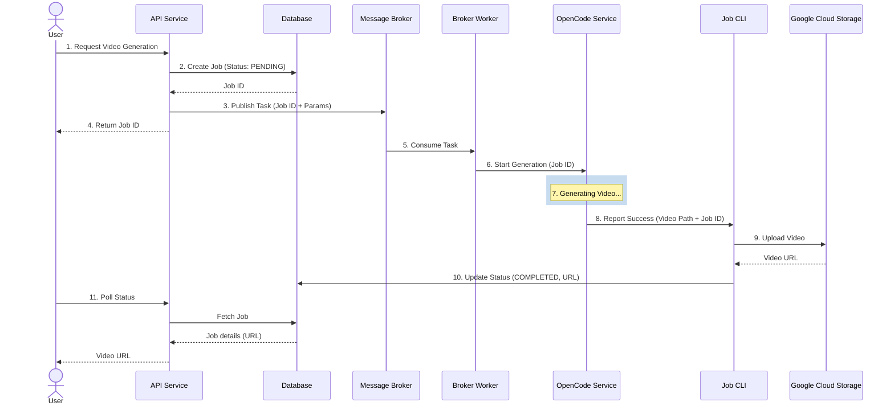
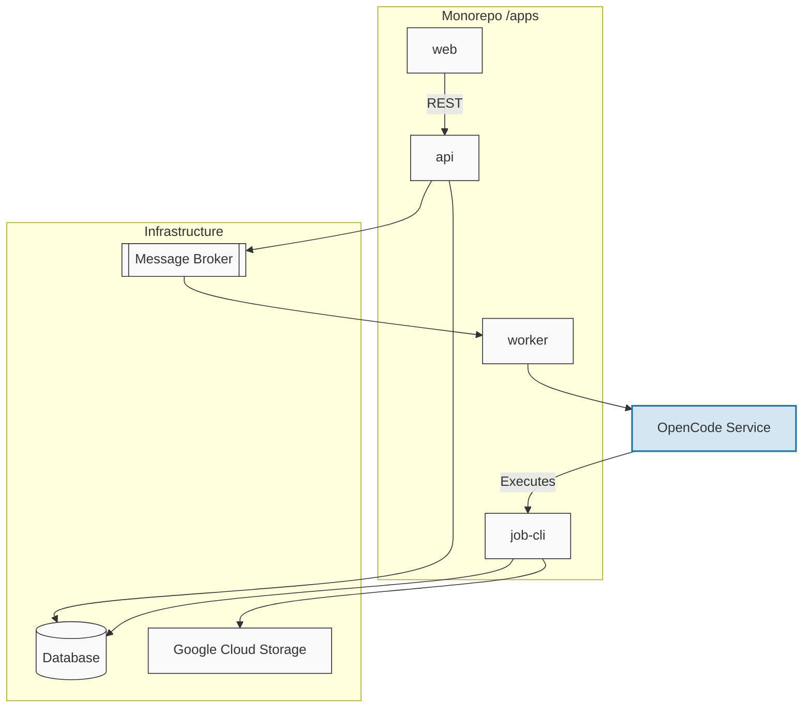

# Video Generation SaaS Architecture

This document outlines the architecture for the video generation SaaS platform, detailing how tasks are queued, processed by OpenCode, stored in Google Cloud Storage (GCS), and delivered back to the user.

## High-Level Architecture

The system consists of the following key components:

1.  **Frontend / Client App:** The user interface where users submit video generation requests and view the final result.
2.  **API Service (Backend):** Handles incoming requests, interacts with the database to track job status, and publishes tasks to the message broker.
3.  **Database (SQLite):** Stores job metadata, user ownership (`userId`), status (e.g., `PENDING`, `PROCESSING`, `COMPLETED`, `FAILED`), and the final GCS video URL. We use a lightweight SQLite setup (`better-sqlite3` or `sqlite` driver) that can be swapped later for PostgreSQL.
4.  **Message Broker / Job Queue:** Queues video generation tasks to decouple the API from the heavy processing tasks. Examples: Redis (BullMQ), RabbitMQ, Google Cloud Pub/Sub, or AWS SQS.
5.  **Broker Worker:** A service that continuously listens to the Message Broker for new tasks.
6.  **OpenCode Service:** The core video generation engine.
7.  **Job CLI:** A specialized command-line utility used by the OpenCode Service to interact with the Database and GCS. This keeps the generation logic separate from the data persistence logic.
8.  **Google Cloud Storage (GCS):** Object storage for the generated video files.

## Monorepo Structure (Rust)

To maintain modularity without polluting the project root, we use a nested Rust Cargo Workspace inside the `apps/backend/` directory:

```text
/
├── apps/
│   ├── backend/            # Rust Workspace Root
│   │   ├── Cargo.toml      # Workspace configuration
│   │   ├── api/            # Rust API Service (Axum)
│   │   ├── worker/         # Rust Broker Worker (Job consumer)
│   │   ├── job-cli/        # Rust CLI utility for data persistence
│   │   └── packages/       # Shared Rust crates
│   │       ├── shared/     # Shared types, constants, and logic
│   │       ├── db/         # Database schema and client
│   │       └── storage/    # GCS interaction logic
├── package.json            # Existing root packages
└── architecture.md
```

## Data Flow

1.  The **User** submits a video generation request via the **Frontend**.
2.  The **API Service** creates a new job record in the **Database** with a status of `PENDING` and returns the `Job ID` to the user.
3.  The **API Service** pushes a task payload (containing the `Job ID` and generation parameters) to the **Message Broker**.
4.  The **Broker Worker** consumes the task from the queue.
5.  The **Broker Worker** delegates the generation task to the **OpenCode Server** via an **HTTP POST** request.
6.  The **OpenCode Server** executes the video generation logic.
7.  Upon completion, the **OpenCode Server** (or the worker tracking it) uses the **Job CLI** to:
    a. Upload the final video to **GCS**.
    b. Update the **Database** with the URL and mark the status as `COMPLETED`.
8.  The **Frontend** retrieves the updated URL and displays the video to the **User**.

## Architecture Diagrams

### Sequence Flow



### Component Architecture


