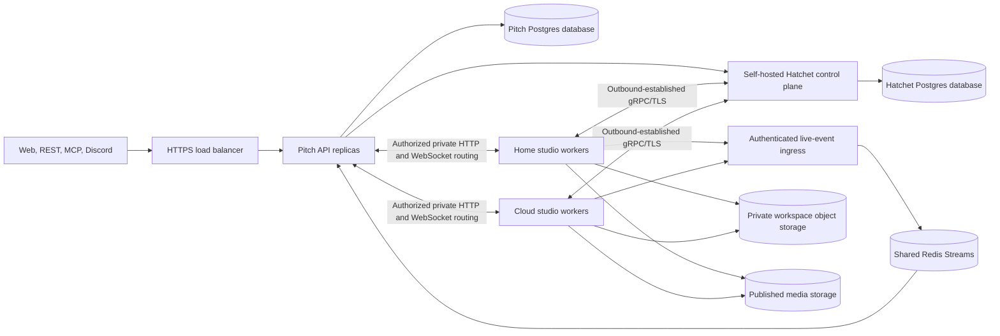

# Hatchet-based hybrid studio: implementation requirements

## 1. Purpose, starting point, and decisions

Build a horizontally scalable Pitch studio using **self-hosted Hatchet** for
execution orchestration. The cloud hosts the application control plane; project
execution can run on cloud machines and a home Linux server. Workers use local
filesystems and durable object-storage checkpoints, without a shared filesystem.

This is a developer handoff, not an implementation or deployment. Create the
implementation branch from the latest `main`. The baseline inspected for this
document is `f216686861ef348854a6c50c8843e60f36ab0e2a`.

**Do not merge or cherry-pick `feat/hybrid-studio-workers` as the implementation
base.** That branch contains an experimental custom orchestrator. The task here is
to implement the requirements directly from `main`, using Hatchet's maintained
SDK and control plane. Files and schemas from that branch are not prerequisites.

The following decisions are fixed:

- **Hatchet OSS, self-hosted**, is the execution orchestrator. No mandatory Hatchet
  Cloud subscription or paid enterprise feature.
- **Docker Compose on Linux VMs** is the initial deployment model. Kubernetes is
  not a prerequisite.
- Infrastructure should run in our own cloud account so eligible VM, database,
  storage, and network charges can use our startup credits. The credit provider,
  region, account, and eligibility must be confirmed before provisioning; this
  document does not assume all providers or Marketplace charges are covered.
- **One active agent/execution owner per project**, with many projects distributed
  across workers. This is horizontal capacity across projects, not several agents
  concurrently editing one project.
- **Postgres** holds product data, credit accounting, and small application
  receipts. Hatchet manages its own orchestration database.
- **Private object storage** holds workspace checkpoints and transcripts.
  Published media uses the existing publication contract.
- **Redis Streams are the baseline live-event/replay transport**, with a small
  application adapter. Hatchet remains the sole task scheduler.
- Use **shared, strict TypeScript contracts and runtime validation** throughout.

The engineer must deliver a working implementation, automated tests, reproducible
deployment configuration, migration tooling, and operating instructions. Merely
wrapping the current singleton API in a Hatchet task is insufficient.

## 2. What exists on `main`

Read `AGENTS.md` and `docs/studio-architecture.md` before coding. Reconcile this
inventory with any changes made to `main` after the baseline above.

| Area | Baseline files | Relevant current behavior |
| --- | --- | --- |
| API startup | `apps/api/src/index.ts` | One process loads pipelines, hosts HTTP, owns sessions, and proxies browser traffic. |
| Project lifecycle | `apps/api/src/projects/service.ts` | Canonical creation path, prompts, status derivation, sharing, rollback, and deletion. |
| Agent integration | `apps/api/src/agent/` | Toolkit, workspace preparation, prompt context, artifact description. |
| Session runtime | `apps/api/src/studio/session.ts` | In-memory session map, queued prompts, steering, transcript recovery, rollback. |
| Events | `apps/api/src/studio/events.ts`, `studio/watch.ts` | In-process event bus and filesystem watchers. |
| Usage | `apps/api/src/projects/usage.ts`, `studio/host-actions.ts` | In-memory model/compute counters; usage totals and debits are currently separate operations. |
| Workspace/history | `apps/api/src/studio/paths.ts`, `studio/history.ts`, `.pi/lib/paths.ts` | Local paths, rollback checkpoints, transcript references, shared read-only resources. |
| Exports and thumbnails | `apps/api/src/projects/export.ts`, `projects/thumbnails.ts`, `flows/launch-video/export.ts` | Local render handles and browser/process state. |
| Browser sessions | `apps/api/src/services/browser-host.ts`, `lib/vnc-proxy.ts`, `routes/browser.ts` | Manager profiles, authenticated VNC proxying, local browser resources. |
| File and project routes | `apps/api/src/routes/projects.ts`, `routes/files.ts` | Local filesystem reads, previews, assets, HTTP streaming. |
| Other entry points | `apps/api/src/routes/v1.ts`, `routes/mcp.ts`, `mcp/server.ts`, `routes/internal-discord.ts` | All must reach the same project service and admission policy. |
| Discord adapter | `apps/discord-bot/` | Separate process/container calling Pitch's internal API. |
| Product storage | `packages/db/`, `packages/storage/` | Prisma/ZenStack registry and S3-compatible storage helpers. |
| Frontend | `apps/web/src/solid/studio/`, `apps/web/src/lib/studio-api.ts` | Studio presentation, SSE client, duplicated wire types. |
| Deployment | `docker-compose.yml`, `docker-compose.prod.yml`, `apps/api/Dockerfile`, `infra/gke/` | Existing Compose and singleton GKE configurations; neither is a ready-made Hatchet deployment. |

Do not assume `main` already contains distributed worker roles, Redis event
delivery, shared studio schemas, or a portable cloud workspace checkpoint format.
Those are implementation work under this specification.
The singleton topology in the existing architecture guide is the starting state;
this specification intentionally changes that topology. Update the architecture
and operating guides as part of the eventual implementation.

The current web configuration is `apps/web/tsconfig.solid.json`, not the older
`tsconfig.app.json` path mentioned in some repository guidance. Verify build
commands against the checkout rather than adding a dummy configuration to hide a
failure. Preserve the current desktop and mobile studio UX on `main`.

## 3. Product invariants

**INV-01 — One studio.** A project is a workspace, conversation, and preview.
Hatchet workflow definitions are orchestration units, not new product categories.
Do not branch on `Project.flow` to choose capabilities. Its legacy use is directory
naming. The agent receives the toolkit and selects its tools from the request.

**INV-02 — Directory-derived artifacts.** Preview selection and the asset shelf
remain derived from workspace contents. Execution metadata may describe queued,
restoring, running, waiting, cancelling, or interrupted work; it must not turn a
stored project category or duplicated status field into the source of truth.

**INV-03 — Existing interaction model.** Preserve file-drop creation without an
agent turn, normal chat, queued follow-ups, steering, question answers, stop,
rollback, DOM targets, time-range targets, asset targets, model selection, and
narration preferences. A greeting must not unexpectedly start media production.

**INV-04 — Canonical admission.** Web, REST, MCP, and Discord project operations
continue through `projects/service.ts` or its deliberate successor. Authentication,
credit eligibility, idempotency, and ownership checks must not diverge by channel.

**INV-05 — Billing semantics.** Nothing is charged merely for opening a project,
uploading material, reading a preview, or waiting in a queue. Preserve the current
eligibility checks and rates; this project is not a pricing redesign. At the
baseline, `CREDIT_USD = 0.0025`, `COMPUTE_USD_PER_SEC = 0.002`, and `MIN_BALANCE = 40`.

**INV-06 — Tool boundaries.** Retain the existing host-tool/agent-sandbox boundary.
Do not introduce cross-pipeline imports or move database/storage concerns into
`apps/api/src/render/`. Keep the render utility tests green.

## 4. Target topology and responsibility boundaries

Event ingress can be part of the Pitch API; it is a logical boundary, not a
requirement to add another deployable service.

| Responsibility | Owner |
| --- | --- |
| Task acceptance by the orchestrator, scheduling, worker registration, task retries, execution timeouts | Hatchet |
| Product authorization, admission receipts, enqueue outbox, credit ledger, public sharing | Pitch API / product Postgres |
| Agent sessions, host tools, local scratch, browser/ffmpeg process lifecycle | Studio worker |
| Portable workspace versions and conversation checkpoints | Private object storage plus a committed metadata pointer |
| Transient token/progress delivery and bounded replay | Redis and a thin SSE adapter |
| Worker connectivity and private preview routing | Standard private networking and HTTP/WebSocket components |

**ARCH-01.** API replicas must not own the only copy of an active agent, queue,
render handle, or conversation. API restarts and load-balancer redistribution must
not cancel otherwise healthy worker execution.

**ARCH-02.** Use Hatchet's SDK and supported worker connection protocol. Do not
build a second SQL-polled task queue, scheduler, general worker RPC protocol,
custom heartbeat fleet, or binary reverse-tunnel implementation.

**ARCH-03.** Small product-specific records are allowed: admission receipts,
transactional enqueue/invalidation outboxes, active-run bindings, and an execution
epoch used to fence stale writes. They must have a documented purpose distinct
from Hatchet's scheduling state. An outbox relay delivers to Hatchet; it does not
decide which worker executes the task.

**ARCH-04.** Keep workers independently deployable from the public API. A shared
image with separate commands is acceptable; separate minimal images are also
acceptable if they reduce dependencies. The Discord adapter remains a separately
restartable service.

## 5. Mandatory Hatchet capability verification

Before broad refactoring, pin a Hatchet engine/image release and compatible
TypeScript SDK. Produce a short architecture decision record with a runnable
spike, exact versions, and evidence for each item below. Use OSS capabilities.

| Capability | Requirement / known qualification |
| --- | --- |
| Delivery guarantees | Hatchet documents at-least-once task execution. Treat duplicate attempts as normal. |
| Cross-operation project concurrency | Verify one concurrency limit across prompt, export, rollback, and file mutations. Current docs state named tenant-scoped shared concurrency requires engine `0.106.0` or later. Separate workflow-local limits do not establish a shared project lock. |
| Queue policy | Use a policy that preserves accepted follow-ups. Do not use cancel-newest or cancel-in-progress as the default chat queue policy. |
| Worker selection | Verify slots and required capability labels in the selected TypeScript SDK. Worker-affinity documentation currently labels the feature beta. |
| Locality | Sticky assignment is currently beta. `SOFT` may move work; `HARD` can leave work waiting for a missing worker. Neither is a filesystem lock or automatic state transfer. |
| Idempotency | Current Hatchet idempotency modes are beta and have TTL/status scopes. A key released at completion does not provide permanent HTTP or billing deduplication. |
| Cancellation | Verify cancellation delivery and propagation to `AbortSignal`, the pi session, child processes, and browser sessions. Cancellation is cooperative. |
| Durable waits | Verify TypeScript event waits, scopes, lookback behavior, and child-task replay before using them for user answers or control messages. |
| Runtime | Verify the selected SDK with the current Bun/pi stack. If a Node worker entry point is required, isolate that change and pin supported runtime versions. Do not assume Bun compatibility. |
| Streaming | Current Hatchet basic streaming docs say events published before a consumer subscribes are dropped. It does not, by itself, satisfy the replay requirements below. |

Durable Hatchet orchestration should perform supported waits and child spawns.
Model calls, file mutations, ffmpeg, and browser operations belong in appropriately
bounded tasks/steps. Wrapping an entire non-deterministic pi session in a replayed
controller does not make its memory or external effects durable.

Use Redis for the baseline reliable UI transport. Replacing that adapter with a
Hatchet-native facility is acceptable only if the pinned OSS implementation proves
the same replay, retention, backpressure, fan-out, and snapshot guarantees in tests.
Do not use arbitrary sleeps to make subscribe-before-publish races appear fixed.

## 6. Project execution and command lifecycle

### 6.1 Admission and durable acceptance

**RUN-01.** Give every accepted mutation a stable operation ID, scoped idempotency
key, request hash, project ID, and trace ID. The API must derive the acting user
from authentication. A client-supplied user ID is not authorization.

**RUN-02.** Commit project creation or mutation intent and an enqueue outbox record
atomically where needed. Cover both crash windows:

1. Product transaction committed, but Hatchet submission did not happen.
2. Hatchet accepted a run, but the API did not record its run ID or return a response.

Retries must converge on the same logical operation. Use Hatchet's supported
deduplication plus an application receipt that survives the platform's dedup window.
Reusing a key with a different payload must return a conflict. Retrying a completed
operation must return its prior outcome without repeating paid work.

**RUN-03.** Do not acknowledge durable acceptance solely because work was put in a
process-local array. Distinguish accepted/queued, actually started, steered into a
live turn, and terminal completion. Preserve existing HTTP response compatibility
where possible; any added execution metadata must be introduced through the
shared contract and frontend together.

**RUN-04.** Use Hatchet events/subscriptions for completion notifications where
supported. A bounded, low-frequency reconciliation of outboxes or uncertain run
references is acceptable. Per-request, per-worker busy polling is not the normal
execution path.

### 6.2 Serialization and live sessions

**RUN-05.** All workspace mutations for a project must share one effective writer
limit. This includes agent turns, asset changes, rollback, deletion, and exports
that read mutable source. An export may run concurrently only against a pinned
immutable workspace version. Metadata-only changes may use explicit transactional
rules without taking the full media execution slot.

**RUN-06.** Preserve FIFO ordering of accepted follow-ups within a project and
fairness across projects. Prove ordering across API replicas, not only inside one
worker process. A slow project must not prevent unrelated projects from dispatching.
Do not hold a project concurrency lock or the only worker slot in a parent that
waits for a child needing that same lock/slot. Durable controllers and heavy child
execution need an explicit, deadlock-free slot/concurrency design.

**RUN-07.** Document whether a live session is owned by a long-lived project
controller or by successive operation tasks. Prove the selected design with queue,
steer, stop, user-question, and worker-loss tests. A normal queued prompt can wait
behind a turn; a stop or steer request must have a path to the active owner while
that turn is running. Do not schedule control messages behind the operation they
need to control.

**RUN-08.** Human answers and queued requests must survive worker/API restarts.
Associate controls with project, operation/turn, and attempt identifiers. A late
answer or steer for an obsolete turn must not silently affect a different turn.
Deduplicate delivery. If steering cannot be applied, report whether it was queued
or rejected; never claim `steered` just because a message was sent.

**RUN-09.** Preserve stop semantics from `main`: stop the active agent and cancel
its queued follow-ups. Export cancellation remains separately addressable. Stop
must not roll back completed edits or erase published outputs.

**RUN-10.** Rollback must restore the selected transcript branch and its matching
workspace checkpoint as one logical operation. Reject rollback while mutation is
active, fence late callbacks from the abandoned branch, publish a new committed
workspace version, and send a thread/preview reset.

**RUN-11.** Read-only project, asset, thumbnail, preview, and history requests must
not start an LLM turn or create new checkpoint versions when nothing changed.
Viewing an idle project must not perpetually reacquire expensive execution slots.
Use committed artifacts, bounded caches, or read-only materialization as appropriate.

### 6.3 Attempt ownership and stale work

**RUN-12.** Maintain the minimum application binding necessary to locate an active
project: Hatchet run/task/attempt identifiers, worker identity/address, execution
epoch, and workspace revision. Hatchet remains authoritative for task scheduling.
Derive presentation state from this binding, Hatchet state, and artifact inspection.

**RUN-13.** Hatchet retries may overlap with a disconnected process that has not
stopped. A stale attempt must not publish a new workspace head, complete a newer
operation, overwrite metadata, or deliver control messages into the current turn.
Use atomic epoch/revision checks for publication. Worker affinity alone is not
fencing. Handle usage reconciliation separately as described in section 11.

**RUN-14.** A replacement attempt must never share a writable physical directory
with a possibly live stale attempt. Use attempt-isolated directories/processes
with a stable logical workspace mapping, or prove the old writer has stopped
before reuse. Cleanup old attempts without killing another project's processes.

## 7. Worker fleet and hybrid networking

**WRK-01.** Support at least two simultaneous workers: one home worker and one
cloud worker, with the same task definitions and compatible toolkit versions.
Workers establish authenticated connections to the Hatchet engine. Home workers
must operate behind NAT without public inbound port forwarding.

**WRK-02.** Prefer maintained private networking, initially WireGuard or an
equivalent private overlay. A paid networking subscription must not be mandatory.
Use private, authenticated HTTP/WebSocket routing for previews and active-session
controls. Do not write a general-purpose networking protocol for this project.

**WRK-03.** Decide and document worker-to-product-database access. The current
host tools import database helpers. For the first release, private least-privilege
database access over the overlay is acceptable; cloud database ports must not be
publicly exposed. If product API calls replace that access, make the conversion
explicit and test every affected tool.

**WRK-04.** Verify container-level routing, not just host-to-host ping. Cloud APIs
must reach private worker endpoints; workers must reach Hatchet, storage, model
providers, and their local browser manager. gRPC requires HTTP/2-aware proxying,
TLS, suitable long-lived connection timeouts, and reconnection handling.

**WRK-05.** Use stable operator-visible worker names and unique process/attempt
identities. A restarted or superseded worker must not accept or poison work
assigned to another incarnation.

**WRK-06.** Configure slots conservatively for CPU, RAM, browser sessions, and
rendering. Use Hatchet slot costs or supported capability-specific workers where
appropriate. Required capabilities are hard constraints. Home-first placement is
a soft preference, with cloud overflow when home capacity is full or unavailable.
Avoid hard home-only affinity that strands work indefinitely.

**WRK-07.** Prefer cache locality when it does not violate capacity, version, or
capability requirements. A home worker returning after failover must join as
available capacity, not automatically reclaim an already-owned active project.

**WRK-08.** Pin engine, SDK, worker image, model/tool configuration, and checkpoint
schema versions. Reject incompatible new assignments. Document how running work
drains across deployments. Do not trust a human-readable worker name alone as a
compatibility or ownership check.

**WRK-09.** On shutdown, stop accepting new work, drain within a configurable
deadline, propagate cancellation, flush usage/checkpoints where safe, and release
resources. A supervisor must terminate the complete process group on forced
shutdown. Task cancellation must not leave orphan ffmpeg/browser processes.

Idle workflow waits should release heavy compute slots. A deliberately live
browser or recording is still a resource allocation and needs ownership, limits,
and a documented idle/expiry policy.

## 8. Workspace and conversation durability

**FS-01.** Local SSD is the execution filesystem; object storage is the durable
transfer/recovery layer. Do not require EFS/NFS across home and cloud, synchronize
every filesystem operation over the WAN, or treat an S3 mount as the working disk.

**FS-02.** Define a versioned checkpoint manifest covering:

- Logical project/workspace identity, schema version, and compatible runtime version.
- Relative paths, content hashes, sizes, required file modes, and supported link metadata.
- Conversation transcript reference and committed transcript position/branch.
- Rollback history and its referenced blobs. On `main`, `.pitch-history` is a
  sibling history tree; copying the project directory alone is insufficient.
- Parent workspace revision, execution epoch, and the operation/attempt that produced it.

Include sources, uploaded material, generated assets, audio, recordings needed for
editing, render metadata, and timeline/beat sidecars. Scratch files outside the
workspace should remain local. Identify immutable shared engine/skill/assets by
pinned version rather than uploading identical libraries every turn.

**FS-03.** Upload immutable content-addressed blobs and transfer only changed
content. Do not acknowledge a durable checkpoint until every referenced blob is
present and verified. Publish the manifest/head pointer atomically with expected
parent revision and current execution epoch; partial uploads are never the head.

**FS-04.** Snapshot at safe boundaries: initial preparation, completed mutating
operations/turns, and before handoff. Add intermediate safe checkpoints where long
work warrants them. Never pair a newer transcript position with older source
files. Await pending transcript/history writes. An active browser/ffmpeg process
is not serialized by copying its partially written output file.

**FS-05.** Restore into staging, validate the manifest and every required hash,
then activate the complete workspace/transcript/history set. A failed restore
must leave the last valid workspace usable. Reject path traversal, duplicate
paths, unsafe symlink targets/parents, unsupported file types, and cross-project
blob references. Never follow links to read or overwrite another project's files.

**FS-06.** Make conversation recovery portable across hosts. Resolve stored
absolute `sessionFile` paths deliberately; preserve logical working-directory
semantics required by pi and host tools. Do not silently discard an inaccessible
transcript and start a new conversation during migration or failover.

**FS-07.** Reuse a local cache only when its manifest/revision matches the committed
head and it belongs to the current attempt. Detect stale/dirty caches. Cache
eviction must not delete the only durable copy or an active attempt's files.

**FS-08.** Keep workspace/transcript storage private and separate from public media.
The existing storage helper can create a public bucket policy; it must not be
reused unchanged for private checkpoints. Large payloads belong in object storage,
with references in Hatchet inputs/results, not base64 blobs in orchestration history.

**FS-09.** Define snapshot, orphan-upload, cache, and deleted-project retention.
Garbage collection must preserve blobs referenced by retained checkpoints and
rollback history. Account for object-store versioning when documenting deletion.
Use person-readable logical asset names even when physical blob keys are hashes.

**FS-10.** Existing storage is S3-compatible. If credits are on another provider,
use a supported endpoint or implement a tested adapter; pointing an S3 client at
a native GCS JSON API endpoint is not a storage migration.

## 9. Live UI events and replay

**EVT-01.** Preserve the studio event semantics: entries, deltas, tool status,
questions, queued messages, busy/idle, assets, previews, project updates, errors,
resets, and deletion. Introduce an explicit resynchronization event and typed
snapshot endpoint where required.

**EVT-02.** Token deltas and frame/progress chatter must not be inserted into
product Postgres or polled from SQL by each viewer. Hatchet's internal durable
task state in Postgres is appropriate; using it as a token-level UI event log is
not the intended design.

**EVT-03.** Use a maintained Redis client and bounded Redis Streams for short-term
replay. Fan out locally from one shared project subscription/read loop per API
replica, with a bounded connection pool. Normal idle SSE viewers must generate
zero database or Redis polling queries. Authentication on connection and socket
keepalives are separate from event polling.

**EVT-04.** Send batches through authenticated event ingress or a supported private
transport. Coalesce adjacent deltas without changing their meaning. Default to a
50 ms flush interval, a 64 KiB batch limit, and bounded in-flight batches; make
limits configurable and measure them. Copy mutable entry data before buffering.

**EVT-05.** Every producer has an attempt identity and monotonic sequence. Retrying
a batch must not duplicate deltas, including a late retry arriving after newer
batches through another API replica. Stream generation/epoch changes must reject
stale producers and cause clients to resynchronize.

**EVT-06.** Bound retention by entry count and TTL, initially 2,000 entries per
project and one hour of inactivity. These are tunable defaults, not a promise of
one hour of complete history at arbitrary throughput. Configure Redis max memory
and an eviction/recovery policy. Redis is not the source of conversation truth.

**EVT-07.** Implement a consistent snapshot-to-live handoff. The worker captures
the thread and event boundary together; the returned cursor must exclude later
deltas. The browser replaces its state and subscribes after that cursor. Cover
events emitted while the snapshot is in flight, concurrent reconnects, disposal,
old initial page loads, and rollback. Never replay earlier deltas on newer text.

**EVT-08.** Missing, expired, trimmed, evicted, or incompatible cursors require an
explicit snapshot. Detect Redis restart/data loss even if some older data survives.
Do not silently continue from a cursor whose continuity cannot be established.

**EVT-09.** Bound worker buffering and per-viewer send queues, initially 512 KiB
each per project/viewer plus documented in-flight buffers. An event transport
outage must not terminate otherwise healthy agent execution. Overflow must produce
a gap/resync outcome. Disconnect slow viewers without blocking fast viewers.

**EVT-10.** Use backoff with jitter for reconnect/replay failures. Redis being down
must not cause a high-frequency Postgres fallback or thousands of immediate
snapshot retries. Durable-state invalidations may use a small transactional
outbox, coalesced per project and deleted after delivery.

**EVT-11.** Route all SSE through the authenticated Pitch API. Do not expose Redis
or Hatchet service credentials to browsers. Cancel backend subscriptions when the
last viewer disconnects and prove there are no leaked listeners, timers, or sockets.

## 10. Previews, media, browser sessions, and APIs

**API-01.** Inventory every route and internal service call that reads worker-local
files or state. Updating only `POST /projects` is not enough. At minimum cover:

| Surface | Required distributed behavior |
| --- | --- |
| Create / prompt | Canonical admission, durable dispatch, current model/options/targets, idempotent result. |
| List / detail / messages | Accurate execution metadata and current or committed artifacts; no process-local-only busy lookup in cloud APIs. |
| Assets / asset thumbnails | Owner-authorized shelf derived from workspace, consistent file mutation, correct thumbnails. |
| `/files/projects/*` | Correct project/version routing; private access, range/HEAD support, content types, cache rules, downloads. |
| Engine, fonts, shared libraries, music | Stable resource URLs and versioned shared assets reachable by remote browser managers. |
| Export / status / cancel | Same project ownership boundary, attempt-aware progress and cancellation, durable result publication. |
| Browser auth / CDP / VNC | Correct worker/profile routing and ownership checks, including multiple projects belonging to one user. |
| Share / public outputs | Published output remains accessible while home workers are offline. No exposure of private workspace buckets. |
| REST v1 / MCP | Same lifecycle guarantees as the web app; no direct fallback to local cloud sessions. |
| Discord | Same project creation/account/credit semantics; finished-result notification survives relevant process restarts. |
| Outbound webhooks | Durable delivery records, bounded retries, stable delivery IDs, no duplicate scheduling by multiple API replicas. |

**API-02.** Preserve Clerk auth, API-key routing, supported query-token paths, and
signed preview cookies. Bind private file and browser access to project/user and
current runtime identity. Validate authorization after resolving worker location.
Do not persist an expiring user JWT in a task as its long-term authority.

**API-03.** Media proxying must stream with backpressure rather than buffer whole
videos in API memory. Preserve HTTP range semantics and WebSocket behavior. Do
not let high-volume media traffic starve stop/steer messages or task heartbeats.

**API-04.** Reconstruct a browser after failure from supported saved profile/state
where possible. A live browser, CDP handle, or recording cannot migrate by moving
a JSON file. Mark interrupted recordings accurately, preserve usable material,
and clean up stale live-preview markers and owned browser resources.

**API-05.** The current desktop/mobile layout, preview-first mobile presentation,
activity indicators, question UI, and full-screen/playback controls must remain
functional. New execution states need truthful UI labels rather than an agent
spinner that runs forever when work is merely queued or cannot be recovered.

## 11. Usage, idempotency, and retry safety

**BILL-01.** Meter model usage and host compute durably. Reading and clearing an
in-memory counter cannot be the only accounting mechanism. Give measurements
stable identities and persist long-running compute checkpoints, initially at
intervals no larger than five seconds.

**BILL-02.** Apply each measurement, the cumulative project total, and its credit
ledger effect transactionally. Serialize concurrent charges against the same user.
Use exact monetary arithmetic or a documented deterministic conversion; preserve
the existing credit denomination and rounding semantics.

**BILL-03.** Distinguish logical operation IDs, physical task attempts, provider
request IDs, and measurement IDs. Replayed receipts must not debit twice. Genuine
additional paid attempts must be accounted for under the existing billing policy,
rather than confused with a duplicate notification.

**BILL-04.** Recheck credit eligibility at execution/resumption, not only when a
request was initially queued. Prevent unbounded paid work after credit exhaustion.
If non-billable budget reservations are needed for concurrent projects, document
their lifecycle, release behavior, and bounded in-flight exposure. Queue waiting,
orchestration replay, and checkpoint restoration must not become new user charges.

**BILL-05.** A stale attempt cannot publish project state. Previously incurred
usage from that attempt must still be reconcilable from immutable receipts and
provider evidence. Refunds and adjustments must also be idempotent.

Configure retries by operation, not with one blanket retry count:

| Operation | Required policy |
| --- | --- |
| Read metadata / immutable download | Bounded transient retries with backoff. |
| Upload a content-addressed blob | Safe retry; commit manifest only when complete. |
| Submit to Hatchet | Stable operation identity; reconcile an uncertain response before creating another logical run. |
| Model/generation/TTS provider request | Persist intent and provider identifiers; use provider idempotency/retrieval where available. An unknown external outcome must not blindly create another paid request. |
| Render from an immutable input checkpoint | May restart as a new physical attempt under explicit policy; publish once and account for real work. |
| Live browser recording | Recovery is operation-specific. Surface interruption; do not claim exact in-memory continuation. |
| Credit debit / refund | Permanent application deduplication, independent of Hatchet TTL/status idempotency. |
| External webhook / Discord notification | Stable delivery identity, durable receipt, reconciliation where supported. Document at-least-once behavior where the external service cannot deduplicate. |

No component may advertise exactly-once external side effects solely because
Hatchet durably schedules tasks. Test the crash between external success and
recording that success locally.

## 12. Strict contracts and code quality

**TYPE-01.** Establish a browser-safe shared contract module/package on `main`.
Request/response types, task envelopes, control messages, project/asset/entry
shapes, event variants, checkpoint manifests, and replay snapshots must derive
from shared executable schemas or generated contracts.

**TYPE-02.** New code must not use `any`, unchecked JSON-to-domain casts, double
casts, `@ts-ignore`, or non-null assertions to bypass uncertainty. Treat external
values as `unknown` and validate them. Encapsulate an inadequately typed third-party
boundary once, with validation, rather than leaking unsafe types through the app.

**TYPE-03.** Enable `strict`, `noUncheckedIndexedAccess`,
`exactOptionalPropertyTypes`, `useUnknownInCatchVariables`, `noImplicitReturns`,
and `noFallthroughCasesInSwitch` for the new packages/modules. Establish a staged
plan for legacy files if enabling all options repo-wide is outside the change.
Never weaken checks to make the migration compile.

**TYPE-04.** Use closed discriminated unions and exhaustive handling for operations,
events, and errors. Backend response helpers and frontend calls must reference
the same contracts, with inference that cannot widen the operation key to hide
a mismatched payload. Avoid parallel hand-maintained DTO interfaces.

**TYPE-05.** CI must contain negative compilation tests: incorrect response fields,
wrong task arguments/results, missing snapshot cursors, and unhandled event kinds
must fail compilation. Runtime tests must also reject malformed frames/manifests.
TypeScript annotations alone do not validate network or database contents.

**TYPE-06.** Build shared declarations from source in clean CI/container builds.
Do not let stale `dist` or `.tsbuildinfo` artifacts make contract checks pass.
Pin lockfiles and compatible protocol/checkpoint/task-definition versions.

## 13. Deployment and cloud-credit requirements

**OPS-01.** Supply separate local-development, cloud-control, and home/cloud-worker
Compose configurations. They must work without Kubernetes and without requiring
the control services to run on the home server.

**OPS-02.** Start with a pinned Hatchet Lite + Postgres configuration only if the
measured launch workload fits its documented low-volume use case. Provide the
supported production Compose configuration and clear thresholds for moving to
separate Hatchet components/RabbitMQ. Do not present a single VM as highly available.

**OPS-03.** Use separate Pitch and Hatchet databases/credentials. A shared managed
Postgres instance is acceptable initially if connections, storage, backups, and
load are sized and monitored. Apply each product's migrations through its supported
release process once; workers must not all run schema migrations at startup.

**OPS-04.** All API replicas use the same Redis service and environment namespace.
Use bounded memory/retention and private access. Configure persistence according
to replay needs, but correctness must survive losing Redis data.

**OPS-05.** Cloud workers and the home worker use compatible images and explicit
slots/capabilities. Demonstrate adding a worker without restarting every API. Keep
Linux sandbox requirements, read-only shared resources, and project isolation
working on each host. No production fallback to an unconfined agent shell.

**OPS-06.** Use established TLS/reverse-proxy configuration for application HTTP,
SSE, Hatchet gRPC, and private worker traffic. Remove development defaults such as
insecure gRPC, default administrator passwords, or publicly exposed database ports
from production examples. Credentials belong in the deployment's secret mechanism.

**OPS-07.** Supply liveness/readiness, graceful shutdown, image pinning, rollback,
and restart policies. A Redis outage must not mark the entire execution fleet dead.
A database/orchestrator outage must not be treated as permission for duplicate work.

**OPS-08.** Provide an environment-variable reference covering Hatchet endpoints
and tokens, separate databases, object-store regions/buckets/credentials, Redis,
worker identity/capabilities/slots, networking, browser manager, model/tool keys,
checkpoint/cache limits, timeouts, and shutdown deadlines. Use placeholders only.

**OPS-09.** Provide a monthly cost worksheet using the chosen cloud account:
control VM(s), cloud-worker hours, managed databases, Redis, object storage,
checkpoints/requests, backups, home-to-cloud transfers, and egress. Model/provider
API costs are separate. State credit eligibility and post-credit cost assumptions.
Do not make a new paid SaaS or enterprise licence a hidden production dependency.

## 14. Observability and initial performance targets

Correlate application request ID, operation ID, project ID, Hatchet run/task/attempt
ID, worker identity, execution epoch, checkpoint revision, and usage receipt IDs.
Hatchet's dashboard is the execution view; application metrics must cover the
parts Hatchet cannot observe, including filesystem, billing, and live-event gaps.

Measure queue age, dispatch latency, active/available slots, retries, cancellations,
restore/upload duration and bytes, cache hit rate, disk pressure, browser/process
counts, event batching lag, replay/resync counts, slow-client disconnects, outbox
age, and usage reconciliation failures. Redact user JWTs, credentials, signed
storage URLs, browser cookies, and sensitive tool payloads from infrastructure logs.

These are initial acceptance targets to validate on recorded hardware/topology,
not claims that the existing application or Hatchet automatically meets them:

| Measure | Initial target |
| --- | --- |
| Integration topology | At least 2 API replicas, 1 cloud worker, and 1 home-like worker with isolated local disks. |
| Queue correctness | 20 concurrent lightweight synthetic projects; zero overlapping committed writers for the same project. |
| Warm dispatch | P95 below 1 second when a compatible slot is free; measure restore/model/provider time separately. |
| Live event delivery | P95 below 250 ms for cloud-local producers; below 1 second with 100 ms simulated home RTT. |
| Idle viewers | 1,000 SSE clients across 10 projects: zero per-viewer event database polls and bounded shared subscriptions. |
| Stream load | At least 20 small event batches/second/project on that fixture, without lost/duplicated displayed text. |
| Stop propagation | Cancellable work receives stop within 2 seconds on a healthy network; child processes end within a documented bounded grace/kill interval. |
| Worker-loss handling | Detect and classify loss within 90 seconds; report transfer/restore duration separately and leave uncertain external effects interrupted. |
| Recovery point | No loss of accepted commands or committed workspace versions; unfinished work since the last safe checkpoint may require recovery/restart. |
| Resource bounds | Enforced event buffers, worker slots, local-disk headroom, cache eviction, and finite retry/queue timeouts. |

If a target cannot be met, provide measurements and the precise constraint before
changing it. A test that only starts two containers is not a scaling test.

## 15. Security, isolation, and deletion

**SEC-01.** Enforce tenant/project ownership at API admission, worker routing,
file/media access, and browser access. Test guessing another project's ID and
reusing a token or worker address outside its scope.

**SEC-02.** Workers are trusted hosts running an untrusted agent sandbox. Preserve
the project's filesystem and environment boundaries. API/provider keys stay in
authorized host tooling. A Hatchet task or dashboard input must not become an
arbitrary privileged shell endpoint.

**SEC-03.** Authorize private worker callbacks with service identity and project/run
scope. Reject obsolete attempts, replayed controls, malformed paths, and unsafe
redirects. Browser session identity may require its own binding; do not assume a
user-wide profile belongs to whichever project was most recently active.

**SEC-04.** Deletion cancels/fences queued and active work and prevents delayed
callbacks from resurrecting the project. Remove local caches and private objects
according to the documented retention policy, including transcript and rollback
data. Preserve only the minimal financial/deduplication records required by the
existing product policy. Deleting a failed project must work even when its
workspace never finished initialization or its original worker is offline.

## 16. Failure behavior that must be explicit

| Failure | Required outcome |
| --- | --- |
| API crashes after durable admission | The same logical operation reaches Hatchet or is reconciled; no duplicate project/debit. |
| Browser disconnects | Execution continues; reconnect restores snapshot/replay without rerunning work. |
| Home worker loses networking | Hatchet detects loss; controls show accurate state; stale publication is fenced. Safe work can recover elsewhere. |
| Worker dies during a provider request | Reconcile by provider/request receipt or report uncertainty. Never blindly repeat a paid side effect. |
| Worker dies during upload | Incomplete objects do not become the workspace head. |
| Worker dies after publication but before acknowledgement | Repeated execution finds the committed result and does not republish or bill it twice. |
| Redis is unavailable or evicts data | Agent execution/checkpointing continues where its authoritative dependencies are healthy; UI resynchronizes with backoff. |
| Hatchet is temporarily unavailable | Already-running tasks follow documented SDK behavior; newly accepted intents remain recoverable. No second scheduler is activated. |
| No eligible worker exists | Return accurate queued/capacity state with finite policy; never report that the agent started. |
| Corrupt/missing checkpoint or transcript | Fail restore visibly, preserve the last valid data, and expose a recoverable diagnostic. |
| Disk fills or sandbox cannot start | Fail before unsafe execution/publication; expose a clear resource/configuration error. |
| Old image reconnects | Reject incompatible assignments and stale callbacks. |

## 17. Implementation sequence and deliverables

1. **Baseline and capability spike.** Record the `main` SHA, existing check results,
   pinned Hatchet/SDK/runtime versions, OSS feature matrix, and one real pi turn
   exercising streaming, queue/steer/stop, checkpoint, and forced worker loss.
2. **Shared contracts and execution boundary.** Establish typed interfaces between
   public API, orchestration, worker session, storage, and live-event delivery.
   Keep the existing single-server path usable while introducing the adapter.
3. **Hatchet integration.** Implement admission receipts/outbox, task definitions,
   project concurrency, attempt binding/fencing, controls, capacity, and recovery.
4. **Portable state and accounting.** Implement checkpoint publication/restore,
   transcript portability, usage receipts, atomic debits, and retry reconciliation.
5. **Distributed reads and live UI.** Route files, previews, assets, exports,
   browser traffic, and SSE correctly; implement replay/snapshot handoff.
6. **Self-hosted deployment and migration.** Supply Compose, private networking,
   configuration, import/restore tooling, backups, and rollback procedures.
7. **Evidence and release.** Run the matrix below, record performance/cost results,
   and produce a deployment checklist tied to the chosen cloud account.

Suggested boundaries include an API-side Hatchet adapter, a separate studio-worker
entry point/package, a browser-safe shared contract package, and storage/event
adapters. These are responsibility boundaries, not mandatory filenames. The final
review must identify which responsibilities are provided by Hatchet and justify
any remaining custom coordination code.

## 18. Migration and rollback from `main`

**MIG-01.** Inventory project rows, existing workspace layouts, pi session files,
sibling rollback history, browser profiles, and public output URLs. Import existing
projects without requiring them to produce another artifact first.

**MIG-02.** Stop intake and drain the old singleton for the initial cutover. Create
and verify backups, upload manifests/transcripts from the host that actually holds
the data, and verify a restore on a different worker. Preserve or deliberately map
logical paths and stable preview-signing configuration.

**MIG-03.** Apply additive application migrations and Hatchet's supported migrations
as separate release steps. Do not include schema changes from the experimental
custom-orchestrator branch. Do not delete the old source directories until imports
and rollback are verified.

**MIG-04.** Enable one cloud worker first, verify the complete user journey, then
add the home worker and a second API replica. Validate the existing web, MCP, REST,
Discord, payment, sharing, and webhook integrations before opening full intake.

**MIG-05.** Rollback must stop intake, cancel/drain and fence Hatchet executions,
restore the newest committed workspace revisions to the chosen singleton host,
and deploy a database-compatible image. Never run old and new mutating owners
against the same project during rollback. Document any irreversible migration and
reconcile accepted operations before resuming intake.

## 19. Required verification matrix

Use real self-hosted Hatchet, isolated Postgres, Redis, and S3-compatible test
storage for integration coverage. Fakes are appropriate for provider billing and
deterministic model output; mocks alone do not prove queue or failure semantics.
All destructive tests must target explicitly disposable infrastructure.

| ID | Scenario and pass condition |
| --- | --- |
| T01 | Web, REST, MCP, and Discord create the same logical project through canonical admission; file-drop creation runs no LLM turn. |
| T02 | Concurrent API replicas submit the same idempotency key; one logical mutation/run outcome and one applicable debit result. Conflicting payload is rejected. |
| T03 | Crash on each side of the API-to-Hatchet submission boundary; acceptance is recovered and no side effect is duplicated. |
| T04 | Prompt, export, asset mutation, and rollback contend for one project; their committed writes never overlap. Another project continues. |
| T05 | Multiple follow-ups survive process restarts in order. No cancellation policy silently drops an accepted message. |
| T06 | Steer and stop reach an active long-running turn without waiting behind its mutation slot. Late controls cannot affect a replacement turn. |
| T07 | Human question/answer arrives before wait registration and during reconnect; exactly the intended logical answer is consumed. |
| T08 | Home worker unavailable/full: cloud overflow works; required GPU/browser/version labels are still enforced. |
| T09 | Worker/network failure and late completion: stale metadata, artifact head updates, and old-attempt callbacks are rejected. |
| T10 | Restore on a different isolated disk reproduces files, transcript branch, rollback history, and timeline metadata. |
| T11 | Missing/corrupt blob, traversal, or unsafe link: restore fails before damaging valid data or leaking another project. |
| T12 | Crash before/after manifest commit and before/after task acknowledgement: only complete committed versions become visible. |
| T13 | Duplicate/late usage reports, concurrent projects for one user, retries, and refunds preserve ledger invariants. |
| T14 | Provider succeeds but response/receipt is lost: reconcile or expose uncertainty; do not silently repeat a paid call. |
| T15 | Same live project viewed through two API replicas; text and event ordering agree, with no per-viewer event DB polling. |
| T16 | Client joins late, reconnects during replay, or receives events during snapshot loading; no duplicate/missing displayed text. |
| T17 | Redis restart, retention trim, eviction, or producer overflow produces a correct snapshot recovery. |
| T18 | Slow viewer and event-ingress outage: buffers remain bounded, fast viewers proceed, workers stay alive, retries back off. |
| T19 | API restart preserves healthy execution; Hatchet restart recovers supported task state; failures are not mislabeled as completion. |
| T20 | Browser authentication, CDP/VNC, thumbnails, HTTP ranges, downloads, and nested preview resources work across the private network. |
| T21 | Public media stays reachable with all execution workers offline. Private workspaces and browser profiles stay inaccessible publicly. |
| T22 | Delete queued, active, failed-initialization, and offline-worker projects; no later callback resurrects them. |
| T23 | Fresh build rejects wrong DTO fields/task arguments, missing cursor data, and unhandled event variants; runtime validation rejects malformed inputs. |
| T24 | Clean images, pinned versions, production-safe configuration, Linux sandbox checks, worker drain, and backup/restore are reproducible. |
| T25 | Run the load/latency matrix in section 14; publish hardware, network shaping, query counts, memory bounds, and results. |
| T26 | Migrate representative `main` projects and rehearse rollback with matching transcripts, files, outputs, and billing state. |

Run repository-required checks plus new contract tests. At the baseline, relevant
commands include `bunx biome check <changed files>`, `bunx vitest run tests/`, and
TypeScript checks for the API and `apps/web/tsconfig.solid.json`. Fix and document
any baseline build-configuration issues rather than suppressing diagnostics.
CI must fail if the required Hatchet/Redis integration suite is silently skipped.

## 20. Definition of done

- [ ] Implementation starts from `main`, with no dependency on the experimental worker branch.
- [ ] Hatchet OSS owns task scheduling, worker registration, retries, and task lifecycle.
- [ ] Capability/version spike proves the selected SDK supports the required interaction model.
- [ ] Cloud and home workers operate with isolated disks and no public home ingress.
- [ ] One effective project writer, reliable controls, and stale-attempt fencing are demonstrated.
- [ ] Committed workspace/transcript/history versions restore on a different worker.
- [ ] Billing and operation receipts remain correct under retry and crash injection.
- [ ] Live UI delivery has bounded replay/buffering and no per-viewer SQL event polling.
- [ ] Shared strict contracts are enforced by compile-time and runtime checks.
- [ ] Existing desktop/mobile studio, public API, MCP, Discord, assets, and sharing behavior passes regression checks.
- [ ] Self-hosted configurations, credit-aware cost worksheet, runbooks, migration, and rollback are delivered.
- [ ] Required integration/failure/load tests pass with recorded evidence.

## 21. Official references

Confirm these against the exact engine and SDK release selected for implementation:

- [Hatchet architecture and guarantees](https://docs.hatchet.run/v1/architecture-and-guarantees)
- [OSS versus Cloud](https://docs.hatchet.run/v1/cloud-vs-oss)
- [Self-hosting overview](https://docs.hatchet.run/self-hosting/index)
- [Hatchet Lite](https://docs.hatchet.run/self-hosting/hatchet-lite)
- [Production Docker Compose](https://docs.hatchet.run/self-hosting/docker-compose)
- [Workers](https://docs.hatchet.run/v1/workers)
- [Concurrency, including shared limits](https://docs.hatchet.run/v1/concurrency)
- [Worker affinity](https://docs.hatchet.run/v1/advanced-assignment/worker-affinity)
- [Sticky assignment](https://docs.hatchet.run/v1/advanced-assignment/sticky-assignment)
- [Durable execution](https://docs.hatchet.run/v1/durable-execution)
- [Durable event waits](https://docs.hatchet.run/v1/durable-event-waits)
- [Cancellation](https://docs.hatchet.run/v1/cancellation)
- [Idempotency and its retention scopes](https://docs.hatchet.run/v1/idempotency)
- [Streaming and its subscribe-before-publish limitation](https://docs.hatchet.run/v1/streaming)
- [Hatchet core licence](https://github.com/hatchet-dev/hatchet/blob/main/LICENSE)
